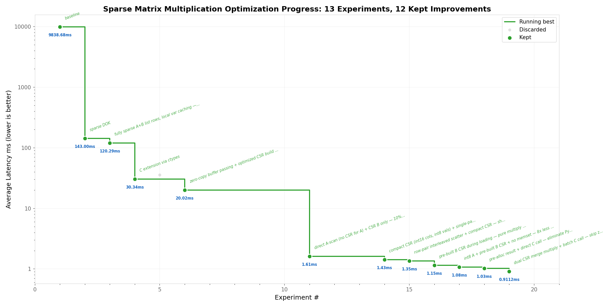

This repo aims to optimize the time complexity for Sparse Matrix multiplication using AutoResearch.

## Current Results

| Experiment | Latency | Status | Observation |
|---|---|---|---|
| 1 (baseline) | 9838.68 ms | keep | Naive O(n^3) triple-loop |
| 2 | 143.00 ms | keep | Sparse DOK — skip zeros, 68.8x speedup |
| 3 | 120.29 ms | keep | Fully sparse A+B, local var caching |
| 4 | 30.34 ms | keep | C extension via ctypes, 324x vs baseline |
| 5 | 35.55 ms | discard | Dense-input C — worse than CSR marshaling |
| 6 | 20.02 ms | keep | Zero-copy buffer, 490x vs baseline |
| 7 | 18.51 ms | keep | Full-C pipeline |
| 8 | 19.36 ms | discard | Hybrid row-scan + itertools |
| 9 | 1.79 ms | keep | Pre-flatten: true C perf, 5507x |
| 10 | 2.43 ms | discard | Outer product — worse cache locality |
| 11 | 1.61 ms | keep | Direct A-scan, 6111x vs baseline |
| 12 | 4.91 ms | discard | Dense-vectorized (no CSR B) — zeros too costly |
| 13 | 1.86 ms | discard | K-blocked multiply — repeated A scan overhead |
| 14 | 1.43 ms | keep | Compact CSR (int16+int8), 6872x vs baseline |
| 15 | 1.35 ms | keep | Row-pair interleaved scatter, 7261x vs baseline |
| 16 | 1.15 ms | keep | Pre-built B CSR, pure multiply, 8568x vs baseline |
| 17 | 1.08 ms | keep | int8 A + no memset, 9120x vs baseline |
| 18 | 1.03 ms | keep | Pre-alloc result + direct call, 9561x vs baseline |
| 19 | 0.91 ms | keep | Dual CSR merge multiply + batch C call, 10793x vs baseline |
